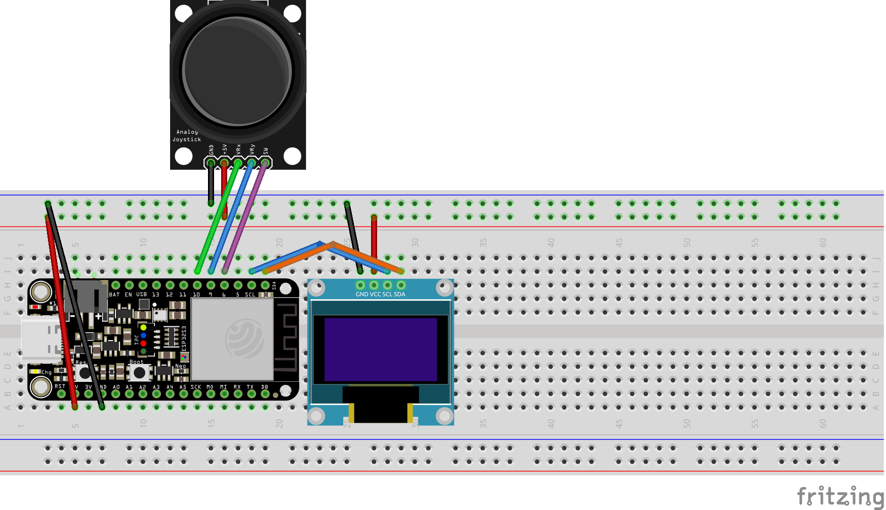

<!-- TOC -->
* [Snake OLED SSD1306](#snake-oled-ssd1306)
  * [Images](#images)
  * [Example wiring](#example-wiring)
  * [Basic example](#basic-example)
  * [Using a different controller](#using-a-different-controller)
<!-- TOC -->

# Snake OLED SSD1306

Hardware/software used
```
Board: Espressif ESP32-S3-DevkitC-1

❯ pio --version
PlatformIO Core, version 6.1.5a4

Monochromatic SSD1306 OLED 128x64 Display

Analog thumb Joystick
```

---
## Images

Classic Snake game, with different difficulties and map sizes. With a selectable menu.


## Example wiring



## Basic example

```c++
#include <Arduino.h>
#include "game/Game.h"

void appStart() {
    Serial.begin(9600);
    std::array<byte, 2> i2cScreenWires = {1, 2};
    AnalogJoystickController controller(6, 7, 5);
    Game game(i2cScreenWires, &controller);

    while (true) {
        game.loop();
    }
}

void setup() {
    appStart();
}

void loop() {}
```

Step by step

```c++
void setup() {
    appStart();
}
```
Calls the application main loop. Can also use Arduino default `loop` function.

```c++
std::array<byte, 2> i2cScreenWires = {1, 2};
```
Set the wires used for i2c communication with the OLED display.

```c++
AnalogJoystickController controller(6, 7, 5);
```
Initialize an analog controller, with the wires 6, 7 controlling the X and Y axis respectively and the wire 5
controlling the button.

```c++
Game game(i2cScreenWires, &controller);
```
Initialize the game object, passing over the array of wires to be used for i2c communication with the screen, and the
pointer to the controller used to control the game.

## Using a different controller

It's possible to add a new controller inside `src/game/controller/Controller.(cpp/h)`.
```c++
class Controller {
protected:
public:
    virtual int8_t x() = 0;
    virtual int8_t y() = 0;
    virtual bool btn() = 0;

    virtual ~Controller() = 0;
};
```
There's a pure virtual class, which any new controller can extend from. Only three necessary functions:
```c++
virtual int8_t x() // returns 1 if controller is reading RIGHT, -1 if reading LEFT or 0 otherwise
virtual int8_t y() // returns 1 if controller is reading DOWN, -1 if reading UP or 0 otherwise
virtual bool btn() // returns true if the main button is pressed, false otherwise
```

With that, it would be possible to have a ButtonController, with 4 directional buttons and a main button.
```c++
virtual int8_t x() {
    if (digitalRead(btnRightPin)) {
        return 1;
    }
    // [...] implementation for other states
}
// [...] implementation for the other functions
```
See `AnalogJoystickController` class for reference.